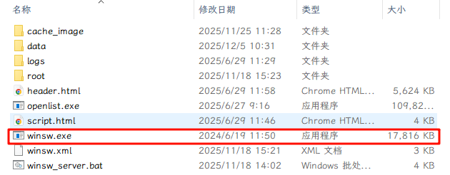
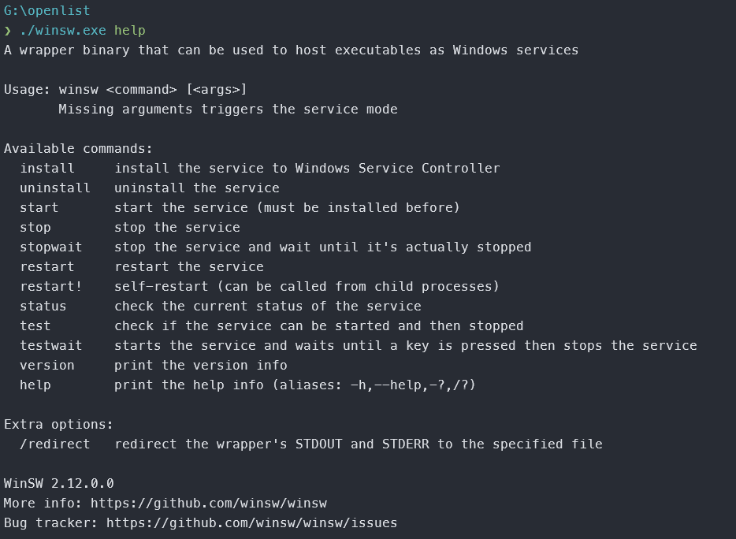

## 下载winsw可执行文件

本篇文章以[WinSW v2.12.0](https://github.com/winsw/winsw/releases/tag/v2.12.0)为准，下载文件后放到需要注册为服务的可执行文件同级目录，本篇文章以openlist为例

首先将文件下载并重命名为winsw.exe



## 创建配置文件

创建文本文件并重命名为`winsw.xml`（注意，此处exe文件可任意改名，xml文件需要和exe同名）

用文本编辑器打开xml文件，并写入如下内容

```xml
<?xml version="1.0" encoding="UTF-8"?>
<service>
    <id>openlist</id> <!-- 服务唯一标识符，Windows内部使用，必须是唯一的且只包含字母数字 -->
    <name>Openlist</name> <!-- 服务显示名称，在Windows服务管理器中显示的友好名称 -->
    <description>Openlist</description> <!-- 服务描述，提供关于服务用途的详细信息 -->
    <executable>%BASE%\openlist.exe</executable> <!-- 要执行的应用程序路径，%BASE%指向WinSW所在目录 -->
    <arguments>server</arguments> <!-- 传递给可执行文件的命令行参数，这里指定以server模式运行 -->
    <startmode>Automatic</startmode> <!-- 服务启动模式：Automatic(自动启动)、Manual(手动启动) -->
    <delayedAutoStart>true</delayedAutoStart> <!-- 延迟自动启动，系统启动后延迟一段时间再启动此服务，减少系统启动负载 -->
    <log mode="roll-by-size-time"> <!-- 日志模式：按文件大小和时间滚动日志 -->
        <sizeThreshold>5120</sizeThreshold> <!-- 日志文件大小阈值(单位KB)，达到5MB(5120KB)后滚动 -->
        <keepFiles>3</keepFiles> <!-- 保留的旧日志文件数量，超过此数量将删除最早的日志 -->
        <pattern>yyyyMMdd</pattern> <!-- 日期格式模式，用于日志文件名的日期部分 -->
    </log>
    <logpath>%BASE%\logs</logpath> <!-- 日志文件存储路径，%BASE%表示WinSW所在目录下的logs文件夹 -->
    <serviceaccount> <!-- 服务运行账户配置 -->
        <username>NT AUTHORITY\LocalService</username> <!-- 服务运行账户，LocalService是低权限账户，安全性较高 -->
    </serviceaccount>
    <stoptimeout>30 sec</stoptimeout> <!-- 服务停止超时时间，等待服务正常关闭的时间 -->
    <onfailure action="restart" delay="10 sec"/> <!-- 第一次失败时，等待10秒后重启服务 -->
    <onfailure action="restart" delay="30 sec"/> <!-- 第二次失败时，等待30秒后重启服务 -->
    <onfailure action="none"/> <!-- 第三次失败时，不采取行动 -->
    <resetfailure>1 hour</resetfailure> <!-- 1小时后重置失败计数器 -->
    <workingdirectory>%BASE%</workingdirectory> <!-- 设置工作目录，确保应用程序能找到相关资源 -->
    <priority>Normal</priority> <!-- 设置进程优先级，避免占用过多系统资源 -->
</service>
```

然后创建`winsw_server.bat`文本文件（可任意命名，后缀为bat即可，这是我用AI写的批处理脚本，可以不用记忆winsw的命令，直接运行脚本然后输入对应数字即可完成对应操作）

```bat
@echo off
chcp 936 > nul

setlocal enabledelayedexpansion

:: 使用唯一前缀避免变量冲突
set "menu_title=WinSW 服务管理脚本"
set "menu_line========================="
set "menu_opt1=1. 安装服务"
set "menu_opt2=2. 卸载服务"
set "menu_opt3=3. 启动服务"
set "menu_opt4=4. 停止服务"
set "menu_opt5=5. 重启服务"
set "menu_opt6=6. 检查状态"
set "menu_opt7=7. 刷新配置"
set "menu_opt8=8. 自定义命令"
set "menu_opt0=0. 退出脚本"
set "menu_prompt=请输入对应数字执行操作: "
set "menu_invalid=无效的输入，请重新选择"
set "menu_complete=操作执行完成，按任意键返回菜单..."
set "action_installing=正在安装服务..."
set "action_uninstalling=正在卸载服务..."
set "action_starting=正在启动服务..."
set "action_stopping=正在停止服务..."
set "action_restarting=正在重启服务..."
set "action_checking=正在检查服务状态..."
set "action_refreshing=正在刷新服务配置..."
set "action_customizing=正在执行自定义命令..."

call :show_menu

:: 主循环
:menu_loop
set "user_choice="
set /p "user_choice=!menu_prompt!"

if "!user_choice!"=="1" call :install_service & goto menu_loop
if "!user_choice!"=="2" call :uninstall_service & goto menu_loop
if "!user_choice!"=="3" call :start_service & goto menu_loop
if "!user_choice!"=="4" call :stop_service & goto menu_loop
if "!user_choice!"=="5" call :restart_service & goto menu_loop
if "!user_choice!"=="6" call :check_status & goto menu_loop
if "!user_choice!"=="7" call :refresh_config & goto menu_loop
if "!user_choice!"=="8" call :custom_command & goto menu_loop
if "!user_choice!"=="0" goto cleanup

echo !menu_invalid!
pause >nul
call :show_menu
goto menu_loop

:: 子程序：显示菜单
:show_menu
cls
echo !menu_title!
echo !menu_line!
echo !menu_opt1!
echo !menu_opt2!
echo !menu_opt3!
echo !menu_opt4!
echo !menu_opt5!
echo !menu_opt6!
echo !menu_opt7!
echo !menu_opt8!
echo !menu_opt0!
echo !menu_line!
exit /b

:: 子程序：安装服务
:install_service
echo !action_installing!
winsw.exe install
echo !menu_complete!
pause >nul
exit /b

:: 子程序：卸载服务
:uninstall_service
echo !action_uninstalling!
winsw.exe uninstall
echo !menu_complete!
pause >nul
exit /b

:: 子程序：启动服务
:start_service
echo !action_starting!
winsw.exe start
echo !menu_complete!
pause >nul
exit /b

:: 子程序：停止服务
:stop_service
echo !action_stopping!
winsw.exe stop
echo !menu_complete!
pause >nul
exit /b

:: 子程序：重启服务
:restart_service
echo !action_restarting!
winsw.exe restart
echo !menu_complete!
pause >nul
exit /b

:: 子程序：检查状态
:check_status
echo !action_checking!
winsw.exe status
echo !menu_complete!
pause >nul
exit /b

:: 子程序：刷新配置
:refresh_config
echo !action_refreshing!
winsw.exe refresh
echo !menu_complete!
pause >nul
exit /b

:: 子程序：自定义命令
:custom_command
echo !action_customizing!
set /p "custom_cmd=请输入自定义命令参数(例如: status): "
if defined custom_cmd (
    winsw.exe !custom_cmd!
) else (
    echo 未输入命令，返回菜单...
)
echo !menu_complete!
pause >nul
exit /b

:: 清理并退出
:cleanup
endlocal
exit /b
```

## 注册和启动服务

### 使用脚本

运行`winsw_server.bat`


输入对应数字完成创建流程

* 安装并启动：依次输入`1 > 3`
* 停止并卸载：依次输入`4 > 2`
* 其他选项如名称所示，可自行探索

### 使用winsw命令



* 安装并启动：依次输入命令`./winsw.exe install`  `./winsw.exe start`
* 停止并卸载：依次输入命令`./winsw.exe uninstall`  `./winsw.exe stop`
* 其他命令可在[官方文档](https://github.com/winsw/winsw#usage)查看
