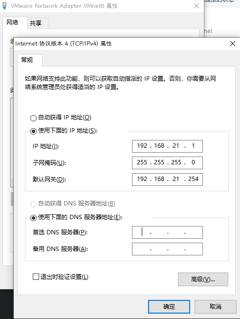
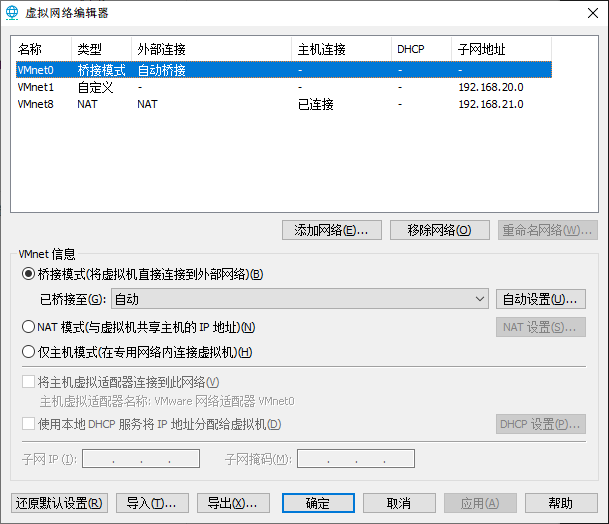
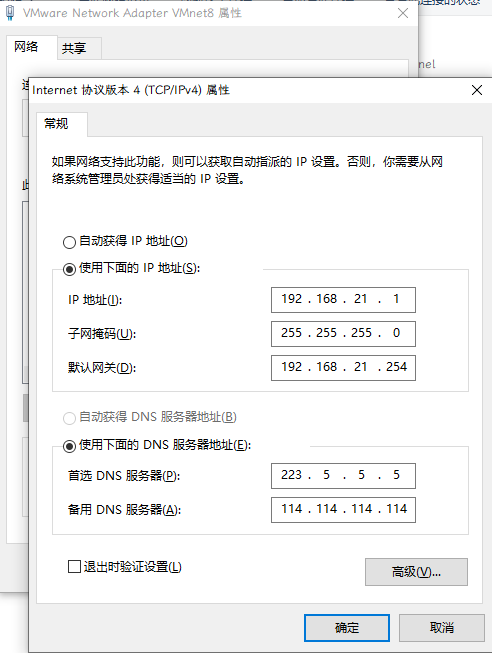

# 省流

把虚拟网卡的DNS地址给删了，留空

# 起因  

我平时使用vmware的时候，不喜欢它自带的DHCP分配地址，所以我都是设置的静态ip 

  

在网卡的设置时，我将所有的项目都填入了对应的ip地址

# 尝试解决  

这导致了一个问题，我在浏览器打开任何网页都会变得超级慢，原本3秒左右能打开的网页直接变成了10秒，这谁能忍啊，果断去网上搜索解决方案，得到的解决方案基本都是禁用虚拟网卡，但是我平时用虚拟机比较多，而且都是linux，要用ssh连接啊，禁用了我连什么？但是没办法，排查不出来问题在哪，咱也没法解决。  

# 成功解决  

在写这篇文章的前10分钟，因为实在受不了龟速加载的网页（一边在虚拟机中操作一边在浏览器中查命令），就又在搜怎么解决网络加载慢这个问题，突然看到了一篇文章[安装VMWare虚拟机之后，发现网络贼卡，打开网页很慢](https://blog.csdn.net/qq_43468008/article/details/129265009)然后在他的这个文章内部有一个参考链接[新知识！虚拟机网卡造成你的DNS解析变慢](https://blog.csdn.net/jiunian_2761/article/details/113407555),然后就突发奇想，把虚拟网卡的DNS地址给删了，留空，结果它就好了……我都不知道该咋形容写文章的时候心情 :|   

