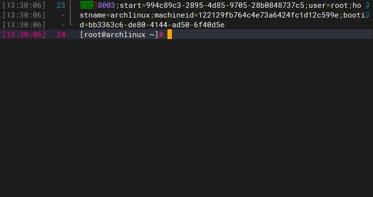

# 解决终端出现“]8003;start=……[root@archlinux ~]#”乱码问题
## 起因
之前把本地的archlinux虚拟机玩坏了，然后就去下载了个新版本`archlinux-2025.10.01-x86_64`，装好之后发现用远程工具连接时出现了一串乱码：

内容大概长这个样子：
>  \
> ]8003;start=994c89c3-2895-4d85-9705-28b0848737c5;user=root; \
> hostname=archlinux;machineid=122129fb764c4e73a6424fc1d12c599e; \
> bootid=bb3363c6-de80-4144-ad50-6f40d5e
> [root@archlinux ~]#

我以为是远程工具的问题（因为当时刚好还更新了远程工具的版本，而且从虚拟机直接访问的时候没问题），但是经过更换远程工具版本、使用其他远程工具等，一一排查，发现问题并不在于远程工具，而是新版本虚拟机的问题

## 问题关键
在浏览器上搜索相关信息时找到了这个链接：
(OSC 3008)[https://systemd.io/OSC_CONTEXT/]

总结一下就是：

我使用的`archlinux-2025.10.01-x86_64`镜像使用了新版本的systemd，这个版本的systemd增加了一个叫80-systemd-osc-context.sh的脚本文件，它会向远程终端发送shell和命令的一些上下文信息
而远程工具还没有支持处理这种信息，就导致了这坨乱码

# 解决办法：

## 在～/.bashrc中添加以下内容：
```bash
#禁用systemd OSC 3008的扩展输出
__systemd_osc_context_precmdline() { :; }
__systemd_osc_context_common() { :; }
__systemd_osc_context_escape() { :; }
PS0=""
```
## 然后重启虚拟机或者重载配置文件：
> 1.重启
> ```bash
> reboot
> ```
> 2.重载配置
> ```bash
> source ~/.bashrc
> ```